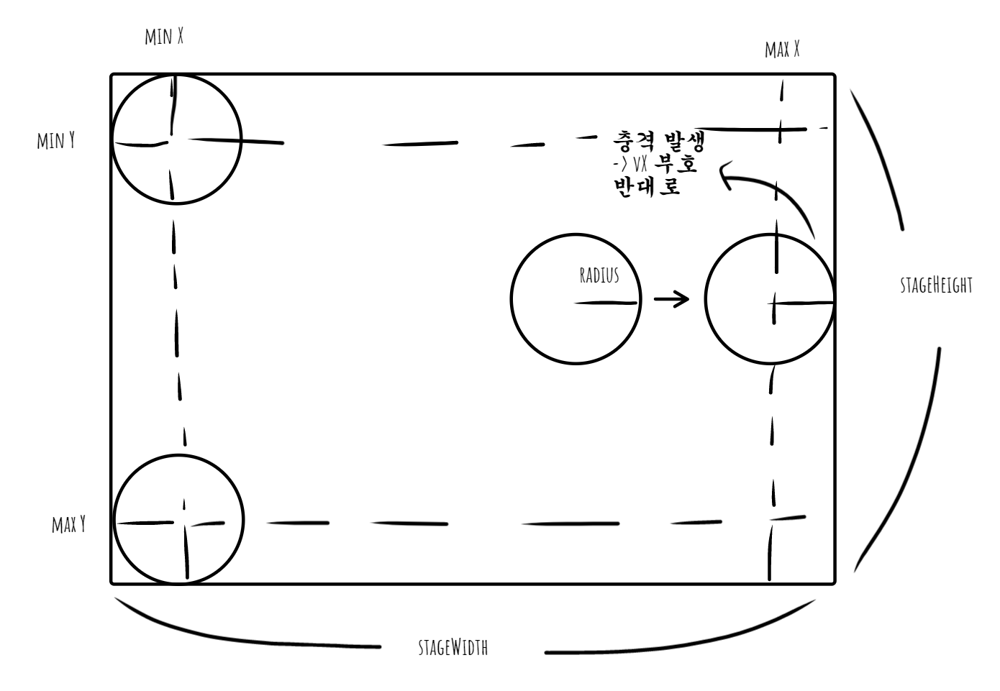
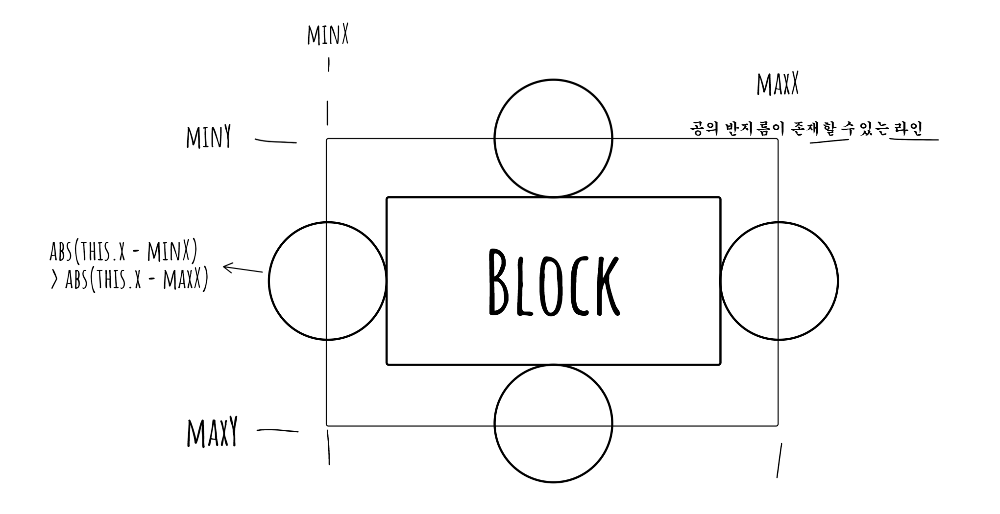

# 공튀기기
Canvas API를 이용

## 개선
- [x] 공 최초 생성 위치가 block 내부가 안되게 수정
  - ball.draw 메서드 내부에 위치 재설정 기능 추가
  - ball.js
```js
  draw(ctx, stageWidth, stageHeight, block) {
    this.x += this.velocityX;
    this.y += this.velocityY;
    const diameter = this.radius * 2;

    // 최초 공의 위치가 block 내부로 걸리면, 위치 재설정
    if (
      this.x >= block.x &&
      this.x <= block.maxX &&
      this.y >= block.y &&
      this.y <= block.maxY
    ) {
      this.x = this.radius + Math.random() * (stageWidth - diameter);
      this.y = this.radius + Math.random() * (stageHeight - diameter);
    }

    // 공 위치가 변하면 충돌
    this.bounceWindow(stageWidth, stageHeight);
    this.bounceBlock(block);

    ctx.fillStyle = "#ffd78a";
    ctx.beginPath();
    // 0도에서 2 * PI * r 라디안까지 원호 그림 -> 완전한 원
    ctx.arc(this.x, this.y, this.radius, 0, 2 * Math.PI);
    ctx.fill();
  }

```

## 보충설명

### 1. 벽 충돌

### 2. 블럭 충돌
